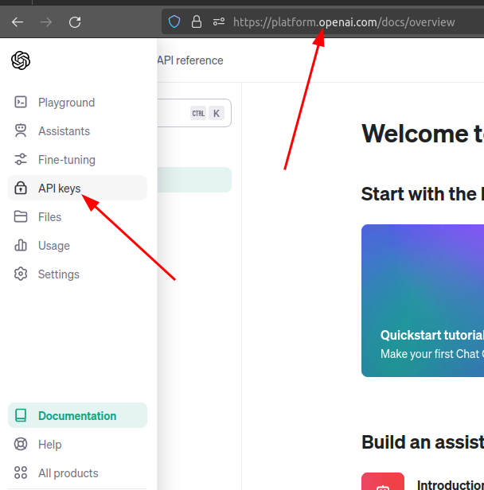
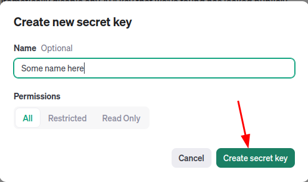

# RAG using Llama-index and OpenAI API

Simple example using [Llama-index](https://www.llamaindex.ai/) and [OpenAI Key](https://platform.openai.com/docs/) to perform Retrieval Augmented Generation. The data is on [data/nova-c.md](data/nova-c.md) and consists of the first paragraph of the article available on the Wikipedia: [https://en.wikipedia.org/wiki/Intuitive_Machines_Nova-C](https://en.wikipedia.org/wiki/Intuitive_Machines_Nova-C)

# Set-up

## Python Dependencies

All the dependencies are in the [pyproject.toml](./pyproject.toml) file. Just install [poetry](https://python-poetry.org/docs/) and run `$ poetry install`

## OpenAI API

1. Go to the [https://platform.openai.com/docs/](https://platform.openai.com/) and on the menu select `API Keys`



2. Click on `Create a new secret key` and `Create secret key`



3. Save the secret key in a file called `.env`:

```text
API_KEY=YOUR_KEY_HERE
```
## Running

1. Activate the environment shell: `$ poetry shell`
2. Run a jupyter session: `$ jupyter-notebook` 
3. Open the jupyter notebook [notebooks/RAGLlamaIndex.ipynb](./notebooks/RAGLlamaIndex.ipynb) (The result is inside the jupyter notebook)


